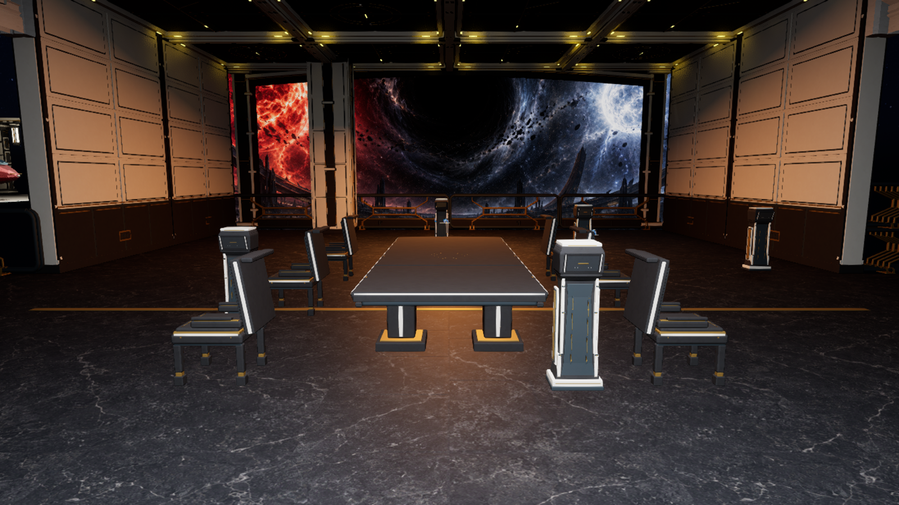
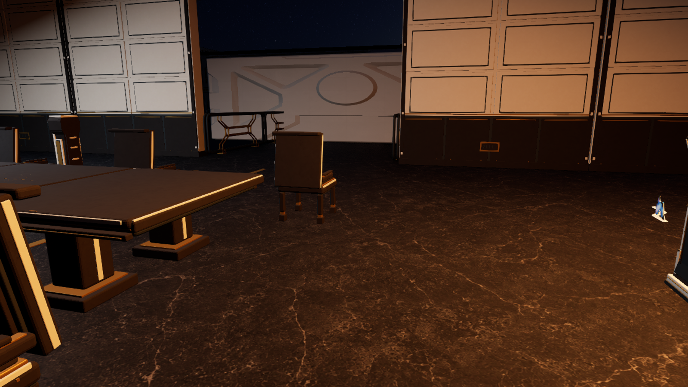
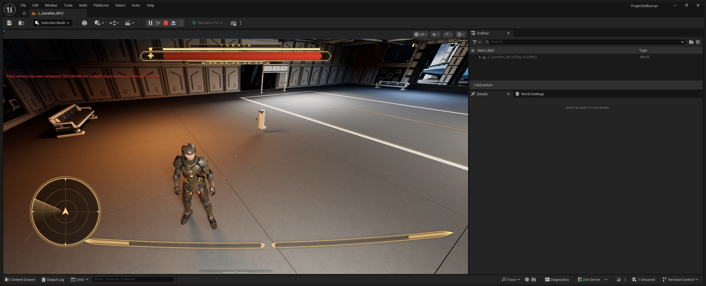

# M13 Z11 conversation furniture refinement, 24 September 2026

The saved observation gallery keeps its one 5 × 2 m table and six seats in
their original chapter-26 positions. The older custom furniture visual read
as flat gray slabs at player height. A new
[focused reference](../ArtReferences/AurelionArchitecture-2026-09-23/Z11-Conversation-Furniture.png)
was generated before the refinement from the saved room view, the August
TDD's quiet-space and Aurelion material rules, the September 24 × 16 m layout
and the manuscript's chapter-26 six-person conversation. Its first variant
rotated the table toward the window and was rejected; the accepted edit
restores the saved 5 m left-right table and three seats per side. The image
guides material/construction detail; the measured map controls placement.

The editable Blender source
[`build_z11_observation_furniture.py`](../../Art/Source/Aurelion/build_z11_observation_furniture.py)
now makes versioned `SM_Aurelion_KIT_Z11ConversationTable` and
`SM_Aurelion_KIT_Z11ConversationChair` meshes. Their old production FBXs and
mesh assets remain available because an open editor had the old assets locked
against overwrite. The refined table has narrow dressed-ivory edge arrises,
seating datum keys, an inlaid witness circumference and finer pedestal
joinery. The chair adds restrained ivory seat/back cheeks and captive gold
contacts. The first Unreal preview made those cheeks too bright; their width
was reduced before the saved pass. No new table or chair actors were spawned.

| Saved player-height view | Image |
| --- | --- |
| Before refinement |  |
| After save and M13 reload |  |
| Close view |  |
| Earned CP9 load in native M13 |  |

The independent Blender FBX round trip in
[`verification.json`](../../Art/Source/Aurelion/Z11ObservationFurniture/verification.json)
passed two UV channels, four mapped material slots, finite positive-area
faces, no collision hulls and the measured visual envelopes. Table: 4.94 ×
1.92 × 0.8005 m, 13,788 triangles. Chair: 0.65 × 0.7775 × 1.1925 m,
7,896 triangles each. The Unreal preview `Z11FurnitureRefinedPreview-20260924-0800`
reimported both assets and compared all 1,544 actor transforms and collision
states before/after an unsaved fit. The reviewed save
`Z11FurnitureSavedRetry-20260924-0820` matched those exact FBX and asset
hashes, updated only the seven pre-existing visual actors, saved M13 and
reloaded it. Its 13 native table/chair cube bodies still own query/physics
collision; the custom visuals remain noncolliding and excluded from nav.
M12 remained `64a4517bb88719694793a46ae859f0eb6fbc861eef10e956e0574d8962b844a4`;
M13 changed from `041d982679eb677b93d2f12cc54e300cf110339499933b5204f83fbbdef1b0fc`
to `29f693af32c51abef71856ad7c87c0ed5e4cb419c9ce6f885e34db9695feaffb`.

The same saved pass disabled Nanite on the five-use witness tablet mesh:
its small `M_AurelionKit_ViewGlass` face is translucent, which Nanite does
not support. The initial in-memory asset refresh dirtied the open M13 map,
so the guarded script reloaded the byte-unchanged map before applying the
furniture fit. The subsequent saved editor log has no translucent-on-Nanite
warnings. The tablet collision and placements remain those documented in
[its earlier review](AurelionZ11WitnessTablets-2026-09-24.md).

`Z11FurnitureEarnedCP9-20260924-0830` booted fresh M12 PIE and copied only
the two exact CP9 banks earned by the earlier passed
`PostRegisterFreshRoute-20260923-224828-a8194366`. Two public
`LoadSlot(CHECKPOINT, 0)` requests entered new native M13 worlds on this
saved map. Both preserved all 35 journal receipts, evidence, facts, protagonist
identity, inventory/resources and separate-exit positions; each had one
working Tarrik HUD at 100 health and released movement/look input. Two native
checkpoint refreshes were observed and both map files stayed byte-identical.
The rendered captures show no duplicate HUD or cinematic overlay. They also
show a video-memory-over-budget warning while another Unreal editor remained
open, so this run does not qualify target-PC performance.

This is a room-scale visual improvement, not 90% TDD visual acceptance. A
fresh post-fit CP0 interaction route, physical local-player movement around
the chairs, packaged performance, lighting/material polish and audio remain
open. The two preceding fresh tablet-route tests stopped at M12 E1 before
entering this room. No further Higgsfield generation or production mesh was
used for this pass.
