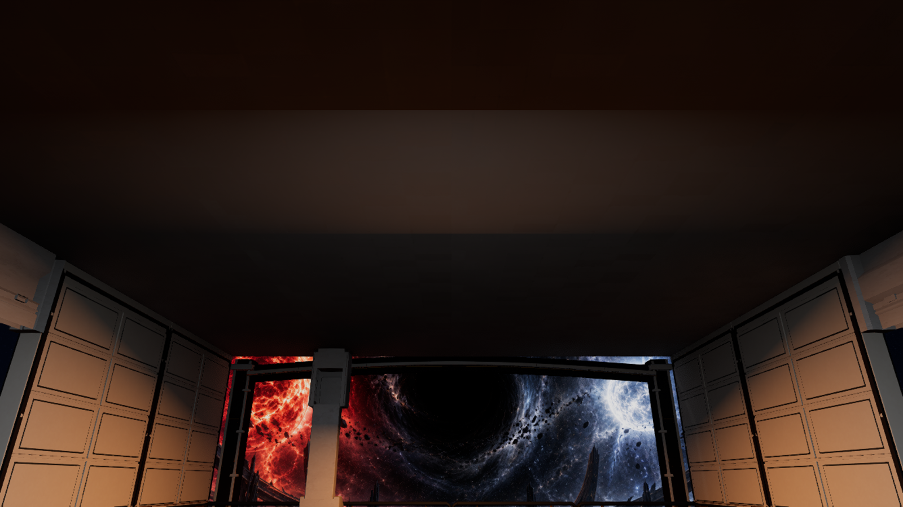
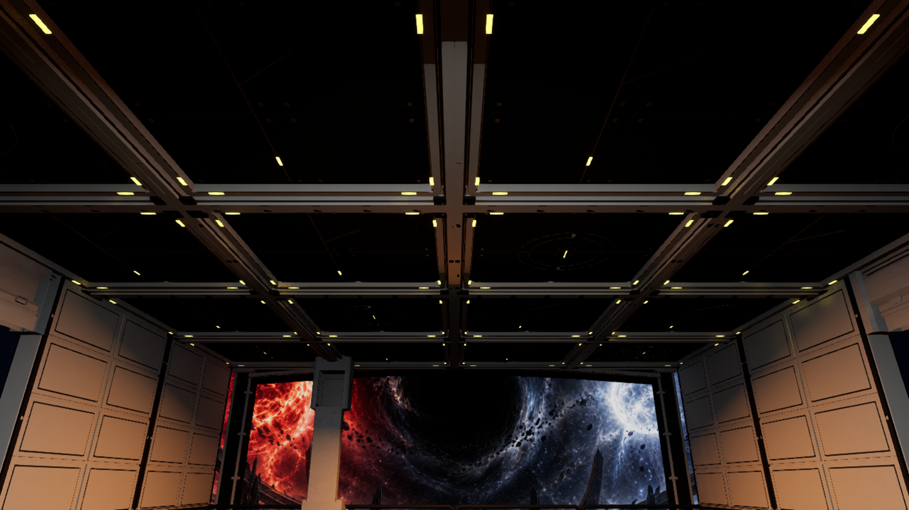
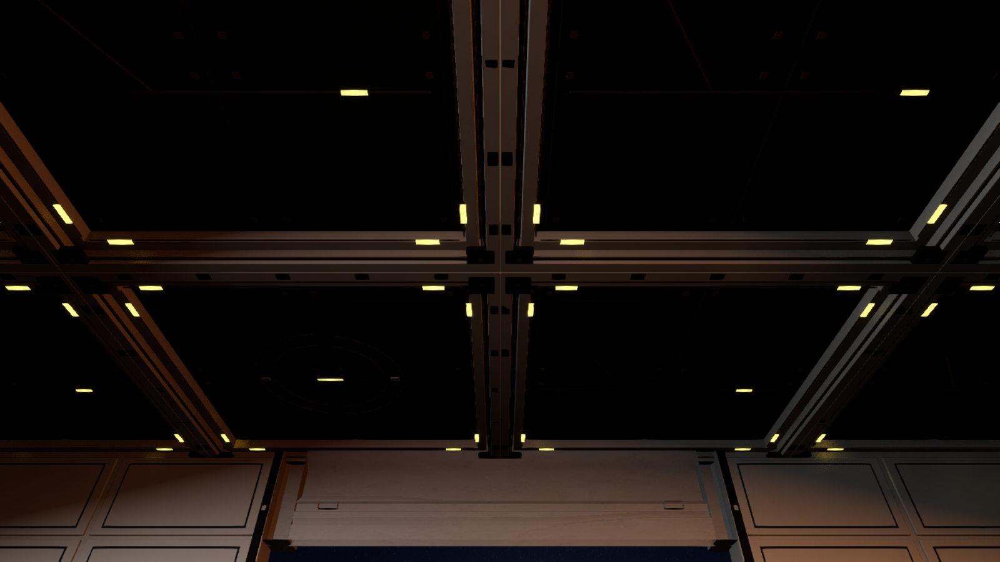

# M13 Z11 observation ceiling, 24 September 2026

The Z11 conversation room now has a measured 6 × 4 grid of Blender-authored 4 m ceiling cassettes in place of 24 noncolliding `SM_Scifi_Floor_04` roof instances. Two variants alternate a quiet conductor and an interrupted service register. Ivory half-beams, black-stone recesses, narrow gold information lines, captive joints and small low-glare contacts establish a room-scale construction rhythm without crossing the west observation window. The central structural pier, one table, six chairs, separate floor art, story actors and existing collision remain untouched. The cassette soffit is at 5.6 m clear height.

The [reference image](../ArtReferences/AurelionArchitecture-2026-09-23/Z11-Observation-Ceiling.png) was generated before modeling from the August TDD, the 7 September level layout, the chapter 26 manuscript brief and the current Unreal room view. Its [prompt](../ArtReferences/AurelionArchitecture-2026-09-23/prompts.md) is preserved. The editable Blender source is `Art/Source/Aurelion/Z11ObservationCeiling/Aurelion-Z11-Observation-Ceiling.blend`; `Art/Source/Aurelion/build_z11_observation_ceiling.py` exports the two FBXs and studio view. Independent Blender re-import in `verification.json` passed exact 4 × 4 m bounds, two UV channels, five named material slots, finite positive-area geometry, and zero authored collision. The A/B variants are 16,544/25,380 triangles; counts track cost, not art acceptance.

The read-only Unreal audit `Saved/Validation/Aurelion/Z11CeilingMeasure-20260924-044219-1b5e2b70` measured 24 visual-only roof instances in a distinct HISM from the separate floor. Two early preview runs stopped on an incorrect floor-instance count before changing the map. The corrected unsaved fit `Saved/Validation/Aurelion/Z11ObservationCeilingPreview3-20260924-045159-526c065a` imported the two owned meshes, placed all 24 visual-only actors on the measured grid and checked their bounds, collision, navigation and other-actor preservation. The fixed-camera stock baseline `Saved/Validation/Aurelion/Z11CeilingBefore-20260924-045633-baf2f459` captured the same room angle. The guarded save/reload `Saved/Validation/Aurelion/Z11ObservationCeilingSave-20260924-045850-350c7584` matched the reviewed actor transforms and FBX hashes, removed only the 24 stock roof instances, restored all 24 custom actors and kept M12's map hash unchanged. M13 changed from `de3c403864fba3a64271f40dcd524fafcaac99e17d024a1be0cc29f9c616dfb9` to `091678448bd179b14630740368644c3c1ebbb4e98a11ab2de4e8b5accae149bc`.

| Fixed room camera | Saved Unreal capture |
|---|---|
| Stock roof |  |
| Custom roof after save/reload |  |
| Custom overhead detail |  |

The custom roof gives the formerly featureless dark plane visible joinery while keeping the stellar view dominant. The recesses remain dark in the current lighting, and the pale window pier and white freestanding kiosks still need visual resolution. Physical-input feel, audio, target-PC performance and packaged execution remain separate acceptance checks; this ceiling pass alone does not establish AAA quality or 90% TDD alignment.

The fresh visible PIE run `Saved/Validation/Aurelion/Z11CeilingRoute-20260924-050204-61fe62ce` started at M12 CP0 on this exact saved M13 map. Entry, E1 and all eight ordinary-input continuation stages passed through native M12→M13 travel, all 13 M13 receipts, the paired lift and separate departures; all 22 M12 receipts remained. E1 needed two actual checkpoint retries and then won through normal Cinderline combat. The same retained editor session made one public CP9 load (`CP9Reload-ea238dc0/checkpoint-reload.json`), which passed in a new M13 world with one successful native callback, all 35 raw journal/evidence rows, stable protagonist/companion identities and resources, completed lift and separate exits held for four seconds. Both M12 and M13 map hashes stayed at the saved values above. This is campaign/checkpoint regression evidence from synthetic application input; it is not physical keyboard, audio, packaged or target-PC performance validation.
