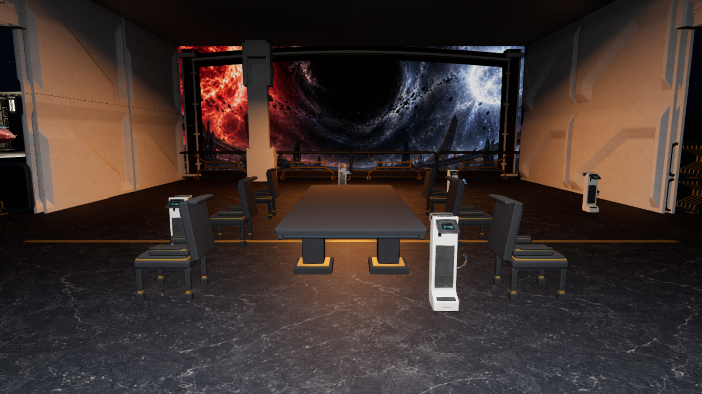
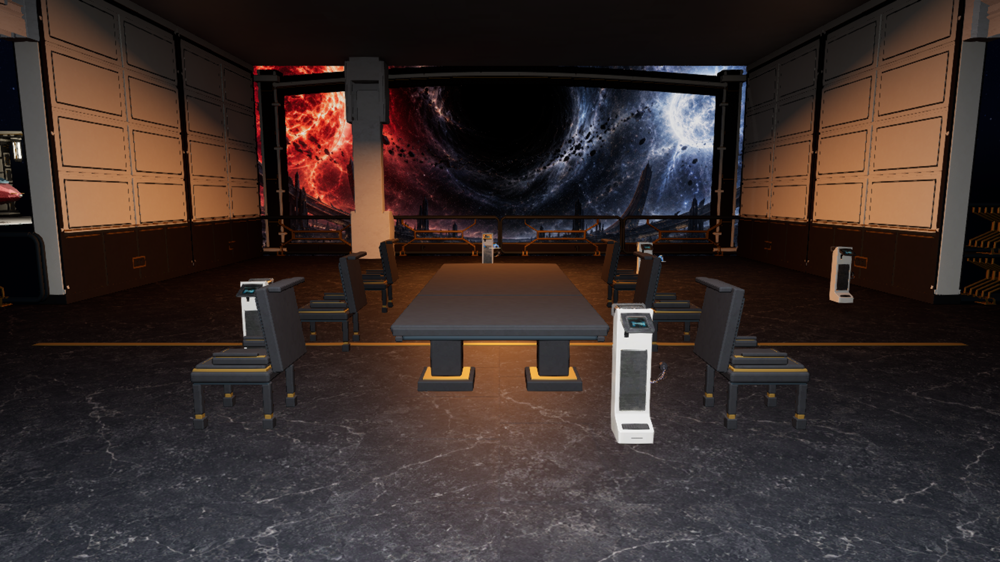
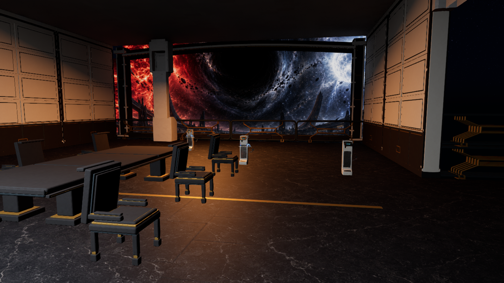
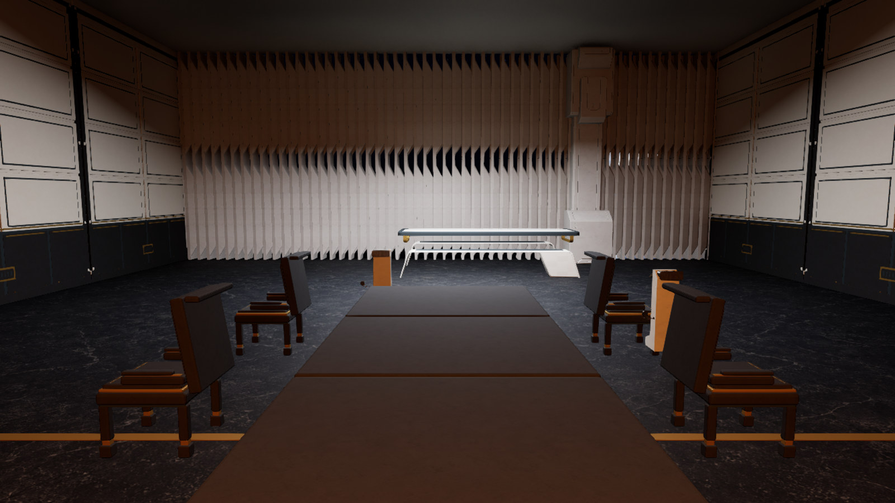
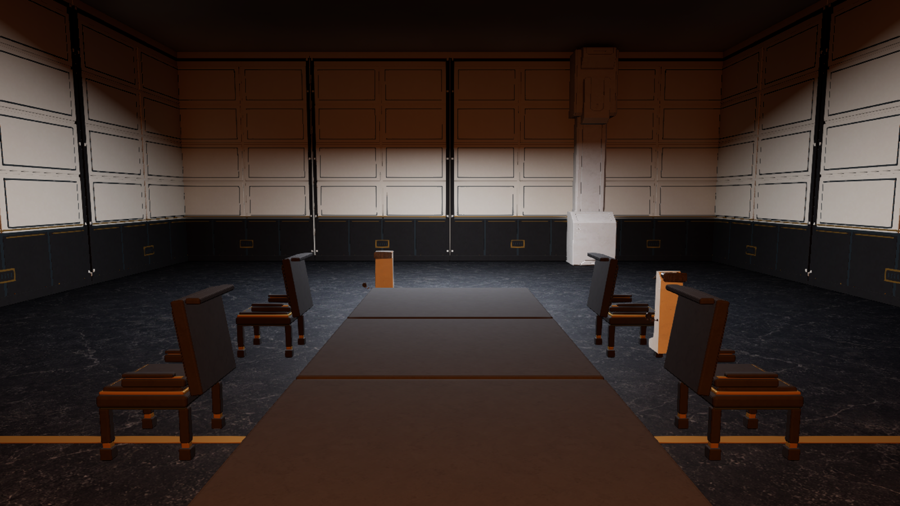
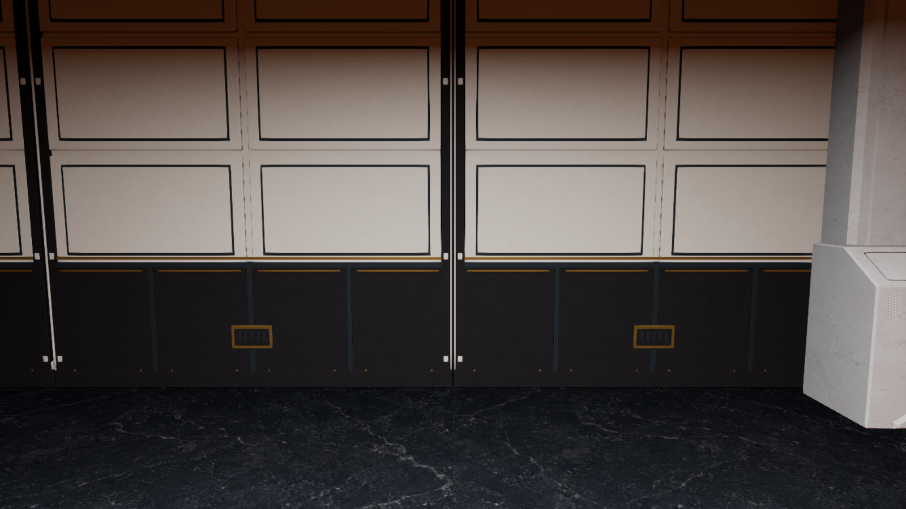

# M13 Z11 observation-gallery wall, 24 September 2026

The chapter 26 observation room has eight custom Aurelion side-wall bays in place of 32 overlapping stock-panel instances, and four matching east-wall bays in place of 114 closely repeated fins. Each bay combines dressed ivory upper stone with a polished black lower register, restrained ancient-gold service lines, and two-sided relief. The view through the broad west wall remains the room's dominant feature; the original one table and six chairs remain, while an extra decorative bench behind the table is hidden. This treatment follows the [generated Z11 reference](../ArtReferences/AurelionArchitecture-2026-09-23/Z11-Observation-Gallery.png), the August TDD's functional gold and white/black stone language, the layout plan's 24 × 16 m Z11 envelope, and the manuscript's deliberately intimate conversation room. It introduces no throne, faction banner, or new interaction.

| Fixed player-height view | Image |
| --- | --- |
| Saved prior wall |  |
| Saved custom wall after fresh map reload |  |
| Saved oblique view |  |

The editable source is `Art/Source/Aurelion/Z11QuietWall/Aurelion-Quiet-Wall.blend`, built by `Art/Source/Aurelion/build_z11_quiet_wall.py`; its FBX, studio PNG, manifest and independent round-trip report live alongside it. The Blender 4.5 round trip verified the 4.49 × 0.50 × 5.992 m envelope, 25,380 triangles, two UV channels, named materials, finite vertices, positive-area polygons and no authored collision. UE imports the owned mesh at `/Game/Aurelion/Environment/ArchitectureKit/Meshes/SM_Aurelion_KIT_Z11QuietWall_4p5x6`, with existing kit ivory, observation black stone, gold and reveal materials.

The source survey `Saved/Validation/Aurelion/Z11WallFieldAudit-20260924-031856-315a242d` recorded all 146 original visual-only HISM transforms and retained native collision. The unsaved preview `Saved/Validation/Aurelion/Z11QuietWallPreview-20260924-032746-e903ecd2` passed the eight-bay bounds/doorway checks and produced the comparison above. The reviewed fit was saved and reloaded in `Saved/Validation/Aurelion/Z11QuietWallSave-20260924-032942-ad52e34a`: M13 SHA-256 changed from `a98dd8dafb2839836d64e18dfadce23cbf52c7b8edd826543e8642de6a271b5c` to `22fbdd20587916329bea43f3f334b39feeb6fa15a28a34d37e070c6b64c53bcb`. M12 stayed at `64a4517bb88719694793a46ae859f0eb6fbc861eef10e956e0574d8962b844a4`. The new visual actors have collision/navigation disabled; all sampled native structural collision, the central six-metre opening, observation window, other actors and 114 narrow east-wall visual instances were retained.

The fresh visible PIE run `Saved/Validation/Aurelion/Z11QuietWallRoute-20260924-033247-a7516cdb` started at M12 CP0 on this exact saved M13 map. Entry, E1 and all eight normal-input continuation drivers passed, including native M12→M13 travel, 22 retained M12 receipts, all 13 earned M13 receipts, paired lift and separate departures. The M13 driver reported assets unchanged. Its same-session public CP9 reload passed in a new native M13 world with one success callback, all 35 raw journal rows/evidence, stable protagonist and companion identities, inventory/resources, completed lift and separate exits held for four seconds. Both map hashes remained at the values above after the run. This is campaign and checkpoint traversal evidence; the fixed images above are the direct wall-art comparison.

The follow-up east-wall audit `Saved/Validation/Aurelion/Z11EastWallAudit-20260924-035459-8d029b51` found one solid, native colliding 16 m east wall, 114 visual-only fin instances, and a separate visual-only decorative bench. The four matching bays are scaled to 3.99 m widths, rotated 90 degrees and fitted entirely within the retained wall. No east-wall gameplay actor was removed. The unsaved preview `Saved/Validation/Aurelion/Z11EastWallPreview-20260924-035826-f120e888` was reviewed from room and close cameras before saving.

| East-facing room view | Image |
| --- | --- |
| Stock fins and extra bench |  |
| Saved custom wall and one table/six chairs |  |
| Saved bay detail |  |

`Saved/Validation/Aurelion/Z11EastWallSave-20260924-040057-b05ac0c6` reloaded and verified the four actor transforms, zero remaining fin instances, hidden decorative bench, unchanged native east-wall collision and protected M12 map. M13 SHA-256 changed from `22fbdd20587916329bea43f3f334b39feeb6fa15a28a34d37e070c6b64c53bcb` to `de3c403864fba3a64271f40dcd524fafcaac99e17d024a1be0cc29f9c616dfb9`.

The fresh visible PIE run `Saved/Validation/Aurelion/Z11EastWallRoute-20260924-040313-08c6d44a` started at M12 CP0 on this exact revised M13 map. Entry, E1 and all eight normal-input continuation drivers passed through native M12→M13 travel, all 13 M13 receipts, the paired lift and separate departures; the 22 M12 receipts remained intact and the M13 driver reported assets unchanged. Its same-session public CP9 reload passed in a new native M13 world with one callback, all 35 raw journal rows/evidence, stable identities and resources, completed lift and separate exits for four seconds. Both map hashes stayed at the saved values after the run. This verifies route and checkpoint continuity on the east-wall revision; it does not establish physical controller feel or rendering performance.

This is an authored visual pass on the Z11 room walls. The central view supports the art direction better, but the pale structural pier, freestanding white kiosks, dark ceiling and broader lighting/material polish remain visible. This pass does not establish AAA visual quality, the 90% August TDD alignment target, physical controller feel, audio, target-PC performance or packaged execution.
