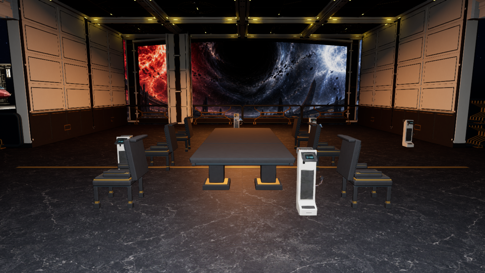
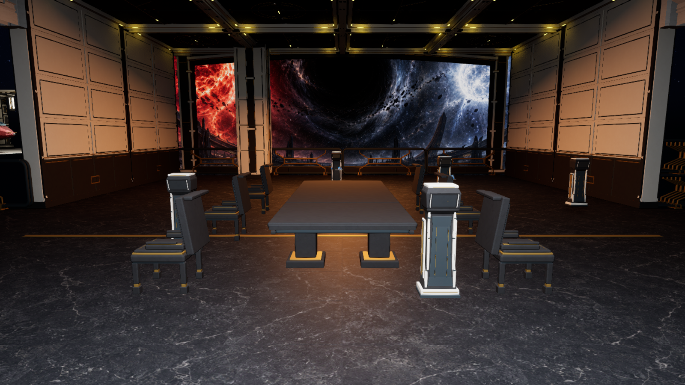
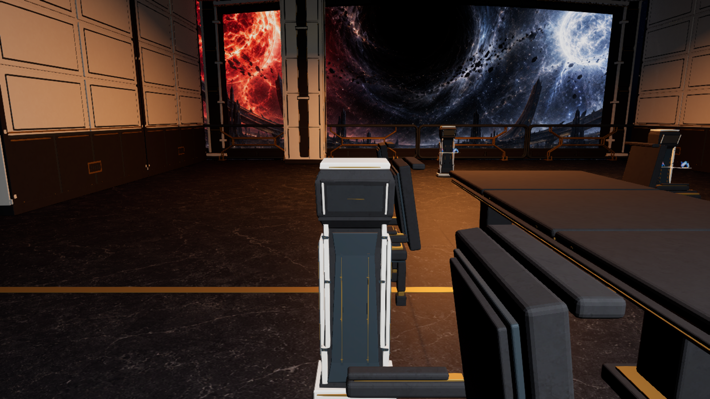

# M13 Z11 witness tablet visuals, 24 September 2026

Five native M13 scene-request actors in the chapter-26 observation gallery
used the same bright KitBash sci-fi console. Their repeated white fronts read
as quest kiosks beside the one table and six chairs, contrary to the August
TDD's quiet-space rule. The visual component on each actor now uses one
original Blender-authored Aurelion witness tablet: a narrower polished
black-stone core, age-cut ivory edge leaves, keyed ancient-gold service lines
and a small recessed dark reading face. The interaction actors, story beats,
separate hologram components, placement and collision bodies remain.

The [focused reference](../ArtReferences/AurelionArchitecture-2026-09-23/Z11-Witness-Tablet.png)
was generated from the saved room screenshot before modeling. It follows the
August TDD's functional gold and quiet-space language, the September Z11
24 × 16 m layout and chapter 26's intimate conversation/window composition.
The [prompt record](../ArtReferences/AurelionArchitecture-2026-09-23/prompts.md)
sets the five retained placements as a constraint, rather than proposing new
interaction stations.

| Fixed player-height view | Image |
| --- | --- |
| Saved KitBash consoles |  |
| Saved custom tablet visual after map reload |  |
| Close view |  |

The [editable Blender builder](../../Art/Source/Aurelion/build_z11_witness_tablet.py)
and [round-trip verifier](../../Art/Source/Aurelion/verify_z11_witness_tablet.py)
accompany the `.blend`, FBX, studio render, manifest and verification report in
[Z11WitnessTablet](../../Art/Source/Aurelion/Z11WitnessTablet/). Blender 4.5
verified 13,088 triangles, two UV channels, five named material slots, no
collision hulls, positive-area geometry and a 0.546 × 0.444 × 1.555 m source
envelope. At the inherited 0.7454 component scale, it fits inside the
native 70 × 50 cm request-body footprint.

The read-only M13 survey
`Z11WitnessTabletSurvey-20260924-0620` measured all five scene-request
actors and their existing `Body`/`Visual` components. The first unsaved Unreal
fit kept the blue stock display material and broad head; its player-height
room view made the devices more prominent, so that fit was rejected. The
refined `Z11WitnessTabletRefined-20260924-0645` preview narrowed the source
in X/Y, darkened the head and used the existing quiet view-glass material. It
verified five unchanged actor and body transforms, unchanged query/physics
body collision, unchanged visual no-collision state and untouched non-target
actors. The saved run matched the reviewed source hash and visual state,
saved M13, reloaded it and verified all five actors again. M13 SHA-256 changed
from `4cc2e71e8d0ae697c7a9cb08bc24b3992623413f03856d8f954879ca79d6598f`
to `041d982679eb677b93d2f12cc54e300cf110339499933b5204f83fbbdef1b0fc`;
M12 remained `64a4517bb88719694793a46ae859f0eb6fbc861eef10e956e0574d8962b844a4`.

The tablets reduce the brightest visual clutter in Z11, but some still sit
close to chair routes because their authored interaction locations are
unchanged. The later [post-fit fresh route](AurelionZ11PostFitFreshRoute-2026-09-24.md)
passed the full M12–M13 progression with the custom visuals installed; its
Z11 held-input requests needed no focus reposition. Physical keyboard/mouse
comfort around the chairs, packaged performance, lighting/material polish and
the broader 90% TDD visual target still need separate qualification.

The later [conversation furniture pass](AurelionZ11ConversationFurniture-2026-09-24.md)
disabled Nanite on this tablet mesh because its small translucent view-glass
material is unsupported by Nanite. The saved asset and M13 room were checked
again after that correction; the five native interaction bodies were unchanged.

The first fresh CP0 route on this exact saved map,
`Z11WitnessTabletFreshRoute-20260924-0658`, stopped in M12 E1 after a fourth
player death and three native retries; it never reached the modified gallery.
The independent fresh retry `Z11WitnessTabletFreshRetry2-20260924-0730`
entered visible PIE and likewise stopped in E1 after a fourth death and
three native retries. Both are bounded route failures, not M13 interaction
passes. An intermediate launch with incorrectly quoted Unreal startup
arguments never entered PIE and is excluded from gameplay evidence.
The companion assets, M12 map and native story actors were not edited for this
slice. A separate public reload of an older earned E4B exit,
`Z11WitnessTabletEarnedE4B-20260924-0702`, did reach M13, but the
`SeleneIndependentAssent` cinematic failed while loading because its required
participant became unavailable, before any of these five requests was used.
Neither run proves the new visual has passed a complete interaction route.
The prior pre-fit route `Z11PierFreshRoute-20260924-054802-fa0e6da3` did
complete the same native M13 requests and CP9, and its earned CP9 reload
passed; those results are historical context, not post-fit acceptance.
