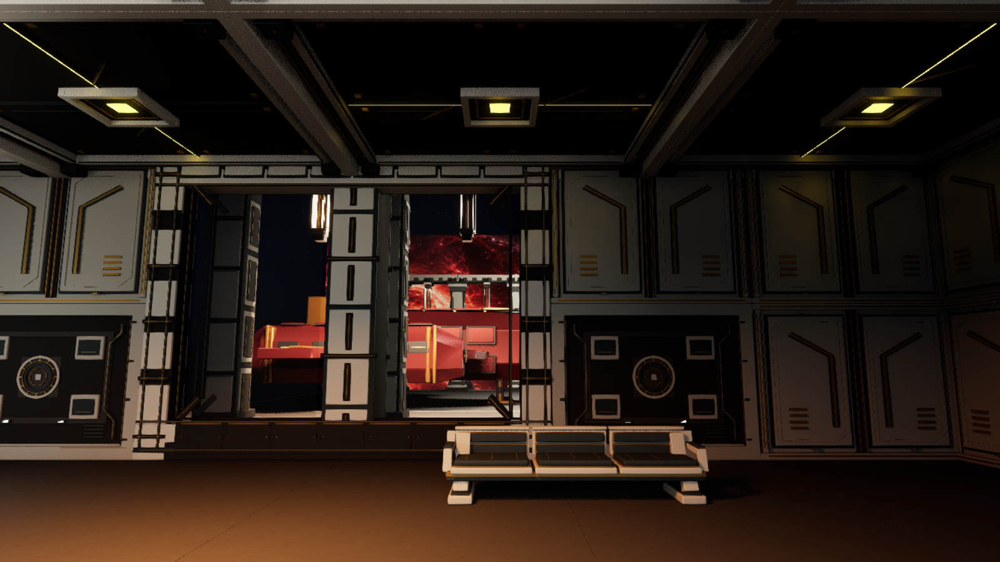
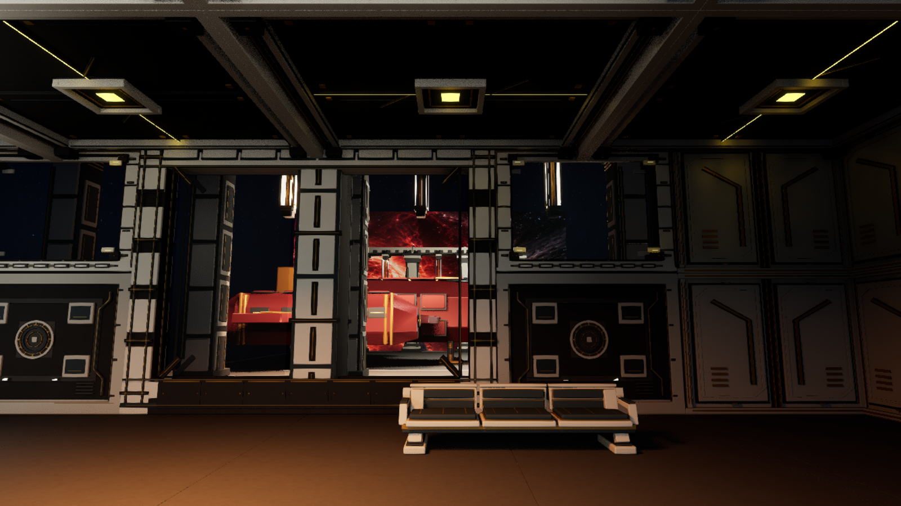
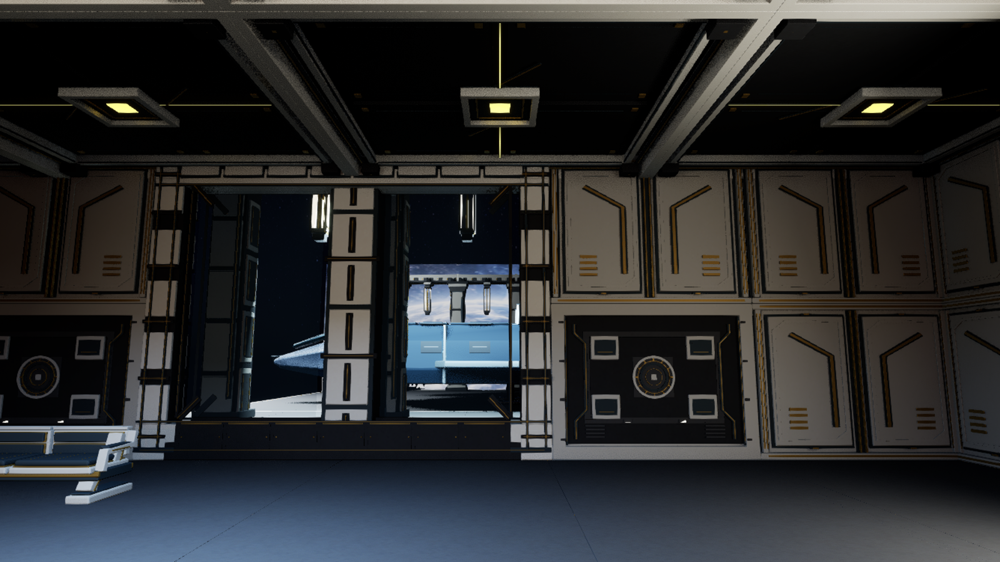
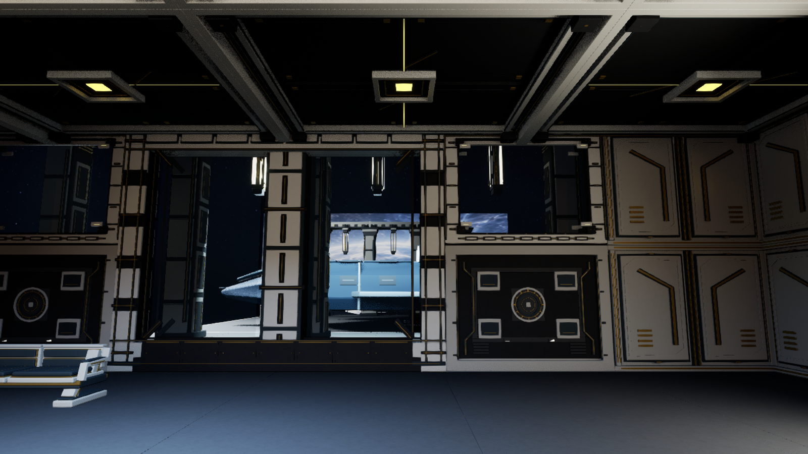

# M13 Z12 upper sidelight, 24 September 2026

The fixed player-eye west/east berth comparisons show a modest improvement to the M13 departure wall: four 4 × 3 m upper coffer cells beside the saved 8 m armored ship views now have custom framed glass. The west bays read as dark exterior with red Dominion spill; the east bays add dark field and a narrow white Reformation horizon. They do **not** reveal entire shuttles or the expansive vista in the generated concept. The central ship views, lower service-register band, structural center ribs and open canopy remain as before.

| Faction | Before | Saved after, fresh editor |
| --- | --- | --- |
| Dominion west |  |  |
| Reformation east |  |  |

The Blender source is `Art/Source/Aurelion/Z12UpperSidelight/Aurelion-Upper-Sidelight.blend`, generated by `Art/Source/Aurelion/build_z12_upper_sidelight.py`. The ring is double-faced ivory/blackstone with captive metal joints and gold conductor detail (37,224 triangles); a separate 188-triangle translucent pane allows Unreal to use the existing glass material without Nanite or shadows. Blender 4.5's independent FBX round trip passed both meshes, exact triangle counts, two UV layers, material names, dimensions within 1 cm, finite vertices, positive polygon area and no collision hulls. See `Art/Source/Aurelion/Z12UpperSidelight/verification.json`.

The unsaved in-engine review is `Saved/Validation/Aurelion/Z12UpperSidelightPreview-20260924-022800-5caa9e1b`. The save report is `Saved/Validation/Aurelion/Z12UpperSidelightSave-20260924-023042-e7cb2eaf/upper-sidelight-save.json`; M13 SHA-256 changed from `3b7e24d4e44f145097fc1424cde5f8c6c43db54477e78f0b961040bdd99c14af` to `a98dd8dafb2839836d64e18dfadce23cbf52c7b8edd826543e8642de6a271b5c`, while M12 remained `64a4517bb88719694793a46ae859f0eb6fbc861eef10e956e0574d8962b844a4`. A separate fresh-editor run, `Saved/Validation/Aurelion/Z12UpperSidelightFresh2-20260924-023422-ac4643c4`, loaded the saved map and passed the eight actor/mesh/position checks. It also verified the eight lower service registers, intact colliding native side walls and center ribs, and disabled collision/navigation on all new visual actors. Map Check reported zero errors and warnings.

The reviewed ship-pose shifts, enlarged full-height bays and upper-only bare isolation were unsaved experiments. Moving the shuttles did not solve the 14–15 m ship versus 8 m structural aperture mismatch; removing the lower service registers mostly exposed empty field. Those variants were not saved. The Higgsfield result was not used for this kit; the authored source and actual in-engine captures are the implementation evidence.

`Saved/Validation/Aurelion/Z12UpperSidelightRoute-20260924-023612-76e3faee` started in fresh visible M12 PIE on this exact M13 map. Entry, E1, E2, E3 entry/rescue, E4 entry/A/B, native M12→M13 travel and the full M13 departure driver passed using normal per-frame input. The route report has 35 final journal receipts and separately earned CP7/8/9. Neither map changed during the run. This verifies campaign traversal on the saved art pass, although the fixed screenshots above remain its direct sidelight visual evidence.

The immediate post-route CP9 observer initially failed at 1.266 seconds because Selene had nonzero velocity immediately after the native load callback. An independent earned-save round trip at `Saved/Validation/Aurelion/Z12UpperSidelightCP9Final-20260924-030326-5dae684c` passed two public CP9 loads. It recorded brief companion movement (about 29 and 48 cm/s on the second load), then four stable seconds after each load, with the exact earned journal/evidence, inventories, resources, separate exit positions, input release, HUD readback and two success callbacks intact. Its map hashes remained unchanged. The strict observer now allows this settling interval before qualifying the departure, with its 180-second deadline and 6 cm exit tolerance retained. The repeated-load harness admits only the single native CP9 generation refresh from 39 to 40 caused by the earlier load; it does not manufacture progression.

An optional second full-route launch, `Saved/Validation/Aurelion/Z12UpperSidelightFinalRoute-20260924-030633-eeb84a60`, stopped in the M12 arrival test before E1: a heavy asset-streaming step completed the arrival without that observer seeing its countdown. It did not exercise M13 or the updated immediate CP9 observer. The successful full route and independent two-load test above are the validation evidence; the direct observer's new settling branch has not yet been exercised by a second full-route completion.

**Qualification:** This supports the saved sidelight and a normal-input campaign route, not 90% August TDD visual alignment, physical keyboard/mouse feel, audio, target-PC performance or packaged execution. The CP9 screenshots were visually reviewed for a live HUD and player at the separate exit; they do not show the companion, whose restored identity and exit transform were checked from the live world.
